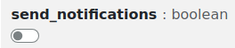
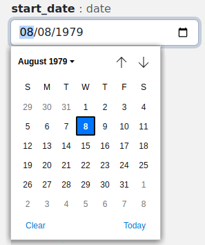
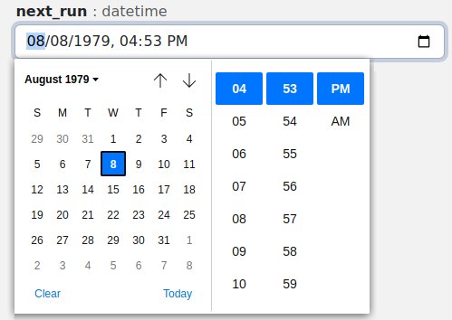
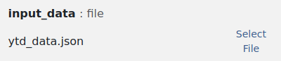
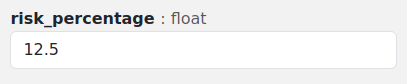
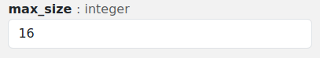
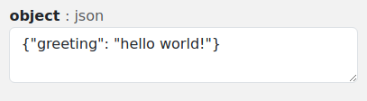
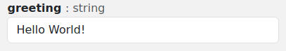

# Parameter Types

Functionary supports functions written in many different languages, each of
which has their own native data types. In order to create a standard interface
for parameters that can work across all languages, Functionary defines its own
types for parameters. These types determine three aspects of how the parameters
will be handled:

- How the input field for the parameter in the UI will get rendered.
- How the parameter input will be validated when executing a function.
- What data type the parameter will be converted to before being passed into the
  function.

The available types are described below.

## boolean

Booleans are represented by an on/off toggle that maps to `true` or `false`.

## date

Dates are a calendar date without a time and are presented via a date picker.
The value will be converted to an ISO formatted string as "YYYY-MM-DD".

## datetime

A Datetime is a date along with a time. The time is always in UTC. Datetimes are
presented as a datetime picker. The value will be converted to an ISO formatted
string as "YYYY-MM-DDThh:mm:ssZ".

## file

Files are represented by a custom picker that will allow the user to either
select a previously uploaded file (one that they own or a publicly shared file)
or upload a new file for use. The file itself is never passed into the function.
Instead, the parameter is passed to the function as a string containing a
pre-signed URL which can be used to download the file.

## float

Floats are numbers that allow the use of decimals.

## integer

Integers allow for whole numbers only.

## json

JSON parameters are highly flexible fields that allow for any valid JSON to be
entered. The following are all examples of valid input into a JSON field:

- `{ "greeting": "Hello World" }`
- `"Hello World"`
- `[ 1, 2, 3 ]`
- `123`

Because of this, the actual type of the data that reaches your function could
vary based on input.

JSON fields are represented via a standard text input field.

## string

Strings are represented by a single line input box.

## text

Text fields are internally treated identically to strings. The use of a Text
field simply indicates an intent that the input may be more than a single line,
and is thus represented via a larger, multi-line text input field.

