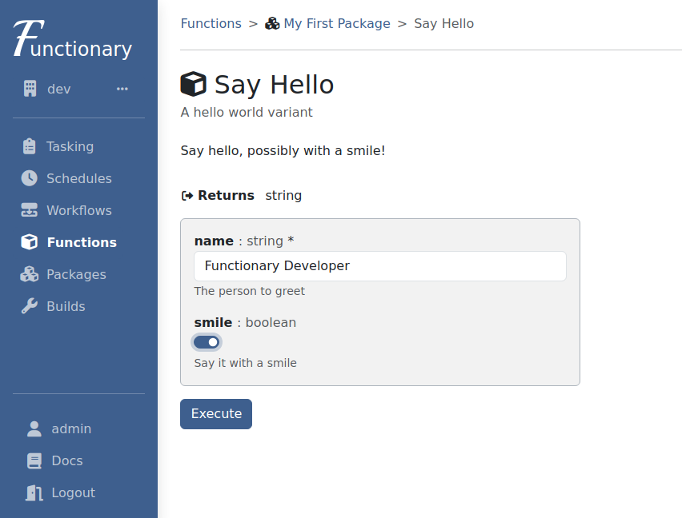
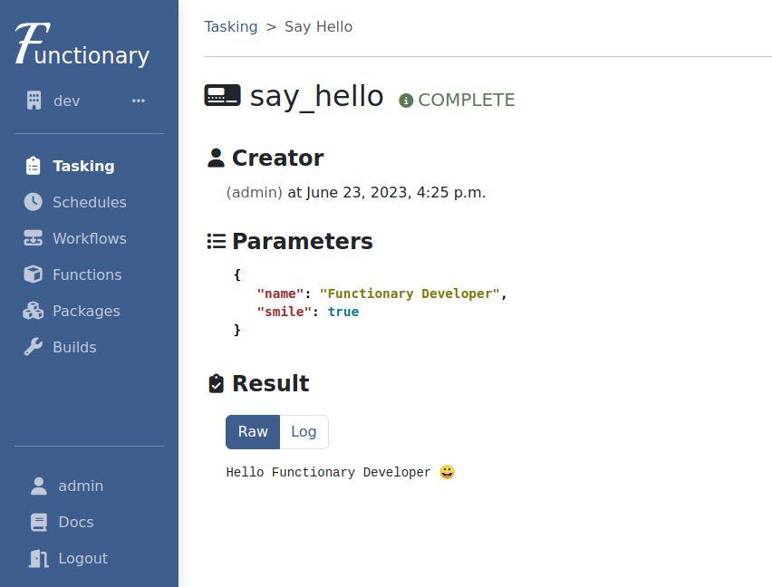

# Create a Package

Individual functions that you want to make available via Functionary are grouped
together in packages. A package can contain as few or as many functions as you
desire. This guide will walk you through the process of creating and publishing
your first package.

!!! note

    The examples in this guide are shown in Python and JavaScript, but the
    general steps are the same regardless of your chosen language.

## Installing the CLI

The Functionary CLI is used to create and publish packages, so be sure to have
it installed prior to following the rest of this guide. For information on
installing and using the CLI, see the
[CLI section of the developer guide](../developer_guide/cli.md).

## Create the package

The scaffolding of a basic package can be created using the CLI:

=== "Python"

    ```shell title="create a package"
    functionary package create --language python myfirstpackage
    ```

=== "JavaScript"

    ```shell title="create a package"
    functionary package create --language javascript myfirstpackage
    ```

This will create a folder named `myfirstpackage` that contains all of the
necessary files. Specifically it will contain:

=== "Python"

    - `functions.py` - This is where we will place our function code.
    - `package.yaml` - Describes our package and the functions it contains.
    - `requirements.txt` - Lists any dependencies that are needed for our functions.

=== "JavaScript"

    - `functions.js` - This is where we will place our function code.
    - `package.yaml` - Describes our package and the functions it contains.
    - `package.json` - Lists any dependencies that are needed for our functions.

## Write your functions

The next step is to write your functions. The process for this is the same as if
you were writing functions without using Functionary. Just place the functions
in the `functions.<ext>` file for your language. In this example, we'll be a
little cliché and write a "Hello World" style function:

=== "Python"

    ```python title="functions.py" linenums="1"
    def say_hello(name, smile=False):
        greeting = f"Hello {name}"

        if smile is True:
            greeting += " 😀"

        return greeting
    ```

=== "JavaScript"

    ```javascript title="functions.js" linenums="1"
    async function say_hello({ name, smile = false }) {
      let greeting = `Hello ${name}`;

      if (smile) {
        greeting = greeting.concat(" 😀");
      }

      return greeting;
    }

    export { say_hello };
    ```

## Describe your package

Now we need to tell Functionary a little bit more about our package and
functions. The `package.yaml` file is used to define things such as
descriptions, parameter and return types. The `package.yaml` that was created
for you has examples and descriptions of the various properties. For our
example, the file should look like this:

=== "Python"

    ```yaml title="package.yaml" linenums="1"
    version: 1.0
    package:
      name: myfirstpackage
      display_name: My First Package
      summary: A simple example package
      description: This is my very first Functionary package!!!
      language: python

      functions:
        - name: say_hello
          display_name: Say Hello
          summary: A hello world variant
          description: Say hello, possibly with a smile!
          return_type: string

          parameters:
            - name: name
              description: The person to greet
              type: string
              required: true
            - name: smile
              description: Say it with a smile
              type: boolean
              required: false
    ```

=== "JavaScript"

    ```yaml title="package.yaml" linenums="1"
    version: 1.0
    package:
      name: myfirstpackage
      display_name: My First Package
      summary: A simple example package
      description: This is my very first Functionary package!!!
      language: javascript

      functions:
        - name: say_hello
          display_name: Say Hello
          summary: A hello world variant
          description: Say hello, possibly with a smile!
          return_type: string

          parameters:
            - name: name
              description: The person to greet
              type: string
              required: true
            - name: smile
              description: Say it with a smile
              type: boolean
              required: false
    ```

## Publish

That's all you need! Now you're ready to publish your package to Functionary and
start using it. To publish, simply run:

```shell title="publish a package"
# be sure to use your real path and not the placeholder
functionary package publish /path/to/myfirstpackage
```

Once the publish command completes, you'll see a build id returned. It's not
important for right now, but behind the scenes Functionary is taking your code
and packaging it up into a docker image. Your package becomes available once
that build process is complete, which should only take a few seconds for our
simple package. To check the status of the build you can run:

```shell title="check build status"
# be sure to use the build id returned from the publish command
functionary package buildstatus --id <build_id>
```

You can also view the build status in the "Builds" section of the UI.

## Task your Function

Your function should now be available for use in Functionary. Head on over to
the UI and find your function, either via either the "Functions" or "Packages"
pages. Open the page for your function and you'll see a friendly tasking form
that you can fill out like this:



Click "Execute" and you'll soon see your results:



## Next Steps

Congratulations! You have successfully created your first Functionary package!
To learn more about everything you can do, head on over to the
[Developer Guide](../developer_guide/introduction.md).
